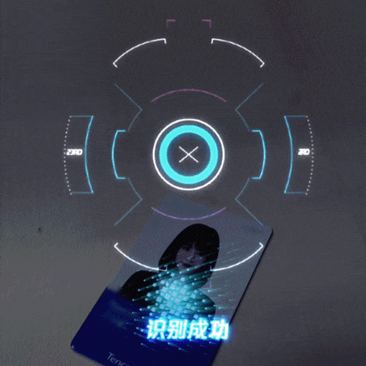

# slam_AR
cellphone camera AR Game
这里分享一下本人做过一些手机移动端相机特效AR玩法

AR特效玩法基本上需要两个元素：1、相机每帧pose(包括R和t)；2、虚拟物体放置位置以及朝向(常见的放置在水平面或者竖直墙面上)。
slam算法可以实时30fps/60fps估计每帧相机的pose，同时提取出环境中有哪些平面，平面距离以及法向量，这样就可达到AR交互的一个基本需求。

按照场景划分几种常见玩法：
1、平面玩法
这种玩法针对场景一个单纯大平面，用户要求启动能够马上点击、而且点击位置必须在平面上。一般用户移动距离不会太大，比如办公桌附近。
<!-- 

 -->

  
  

2、空间任意场景玩法
这种玩法对环境没有特征要求，用户可随意移动，相对于第一种玩法移动距离更远，达到几十米甚至上百米。点击放置虚拟物体可在某个平面上(比如地面)，或者悬浮空中，对大场景远距离移动定位精度要求较高。
<!-- 

 -->

  
  

3、针对地标建筑打卡玩法
这种玩法一般针对特定地标建筑物（比如东方明珠、黄鹤楼等）。通常用户相机对准建筑物时候，需要快速识别出建筑物距离及方位，出来虚拟特效包裹着真实建筑物，形成一个虚实集合效果。此类玩法通常用户移动距离不大，主要是相机左右旋转为主。
<!--  -->

  

4、卡片勒特效玩法
此种玩法可以认为是第一种玩法衍生，一般需要用户主动打开相机扫一扫。通过卡片识别以及轮廓提取，来发掘卡片中藏有的故事性，能大大提高玩家趣味性。
<!--  -->

  

5、场景深度类玩法
此种玩法要求实时估计相机场景的深度，环境中有哪些桌子椅子还有沙发，沙发结构什么样。利用算法魔力，让用户去尽情探索环境的奥妙吧。

<!--  -->

  

